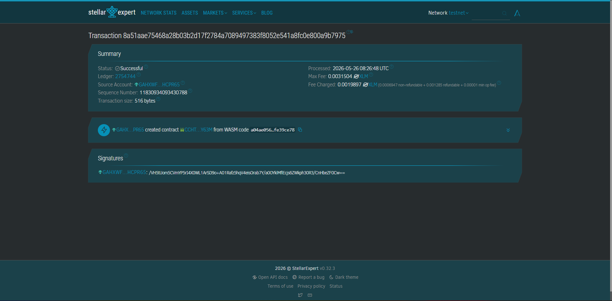

# SupportChain



**Deployed Contract ID (Testnet):** `CCHTZEC4NXUPTAZBJUCQ7J7OMK4GTVN6FABZKTH6IOHCO7CSFOXTY63M`

Automated child support enforcement via Soroban smart contracts on Stellar.

## Problem

Maria, a single mother in Quezon City, has a court order for ₱6,000/month child support. Her ex-husband paid twice then vanished. Filing contempt costs ₱10,000–₱50,000 with 6–18 months of he[...]

## Solution

A Family Court deploys a Soroban smart contract that auto-transfers the court-ordered child support from the paying parent's Stellar wallet to the custodial parent's GCash every month. If the parent d[...]

## Deployment

| Network | Contract ID |
|---------|-------------|
| Stellar Testnet | `CCHTZEC4NXUPTAZBJUCQ7J7OMK4GTVN6FABZKTH6IOHCO7CSFOXTY63M` |

[View on Stellar Expert](https://stellar.expert/explorer/testnet/contract/CCHTZEC4NXUPTAZBJUCQ7J7OMK4GTVN6FABZKTH6IOHCO7CSFOXTY63M)

## Timeline

| Phase | Milestone |
|---|---|
| Hackathon MVP | Deploy Soroban escrow contract, demo scheduled payment + default detection |
| Phase 1 | GCash/Maya integration, Passkey onboarding, pilot with 1 Family Court |
| Phase 2 | BSP-PhilPaSS e-garnishment integration, DOJ auto-referral |
| Phase 3 | OFW cross-border enforcement (Hague Convention) |
| Phase 4 | Named official enforcement platform under Child Support Enforcement Act |

## Stellar Features Used

- **USDC transfers** — stable Philippine Peso-equivalent monthly support payments
- **Soroban smart contracts** — payment schedule, default detection, compliance score
- **Passkey support** — fingerprint onboarding, zero crypto knowledge needed
- **GCash/Maya off-ramp** — funds land in existing mobile wallets
- **3–5 second settlement** — support arrives same day
- **Sub-cent fees** — ₱6,000 transfer costs less than ₱0.01

## Vision and Purpose

There are 15 million single parents in the Philippines. 95% are women. Congress is debating a Child Support Enforcement Act (HB 44, HB 8987) with penalties up to 12 years imprisonment — but there is[...]

## Prerequisites

- [Rust](https://rustup.rs/) with `wasm32-unknown-unknown` target
- [Stellar CLI](https://developers.stellar.org/docs/tools/developer-tools/cli/install-cli) v22.0.0+

```bash
rustup target add wasm32-unknown-unknown

```
